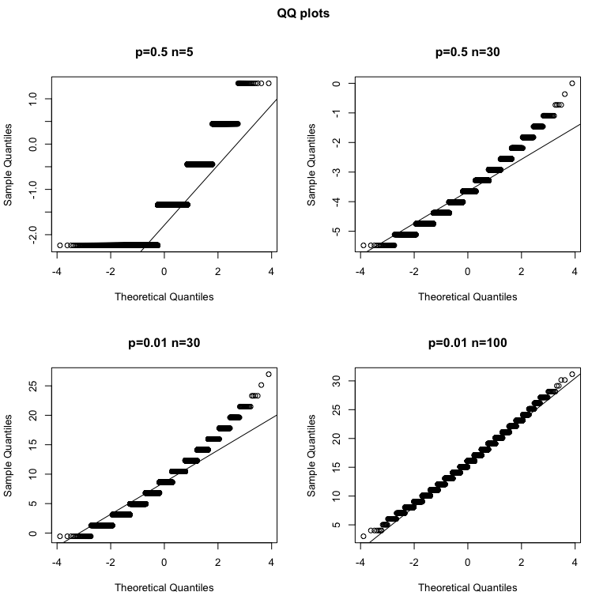

Code for this page was tested in R version 3.5.1. Check RMarkdown file for list of all packages.


```
##  package     * version date       source        
##  backports     1.1.2   2017-12-13 CRAN (R 3.5.0)
##  clisymbols    1.2.0   2017-05-21 CRAN (R 3.5.0)
##  digest        0.6.15  2018-01-28 CRAN (R 3.5.0)
##  evaluate      0.11    2018-07-17 CRAN (R 3.5.0)
##  htmltools     0.3.6   2017-04-28 CRAN (R 3.5.0)
##  knitr         1.20    2018-02-20 CRAN (R 3.5.0)
##  magrittr      1.5     2014-11-22 CRAN (R 3.5.0)
##  Rcpp          0.12.17 2018-05-18 CRAN (R 3.5.0)
##  rmarkdown     1.10    2018-06-11 CRAN (R 3.5.0)
##  rprojroot     1.3-2   2018-01-03 CRAN (R 3.5.0)
##  sessioninfo   1.0.0   2017-06-21 CRAN (R 3.5.0)
##  stringi       1.2.4   2018-07-20 CRAN (R 3.5.0)
##  stringr       1.3.1   2018-05-10 CRAN (R 3.5.0)
##  withr         2.1.2   2018-03-15 CRAN (R 3.5.0)
##  yaml          2.1.19  2018-05-01 CRAN (R 3.5.0)
```

### Random Variables Exercises

#### Basic Intallation and setup


```r
library(downloader) 
url <- "https://raw.githubusercontent.com/genomicsclass/dagdata/master/inst/extdata/femaleControlsPopulation.csv"
filename <- basename(url)
download(url, destfile=filename)
x <- unlist( read.csv(filename) )
```
Here x represents the weights for the entire population.

#### Problem 1
What is the average of these weights?

```r
mean(x)
```

```
## [1] 23.89338
```

#### Problem 2
After setting the seed at 1, `set.seed(1)` take a random sample of size 5. What is the absolute value (use `abs`) of the difference between the average of the sample and the average of all the values?

```r
set.seed(1)
x_sample <- sample(x, size=5)
abs(mean(x_sample) - mean(x))
```

```
## [1] 0.2706222
```

#### Problem 3
After setting the seed at 5, `set.seed(5)` take a random sample of size 5. What is the absolute value of the difference between the average of the sample and the average of all the values?

```r
set.seed(5)
x_sample <- sample(x, size=5)
abs(mean(x_sample) - mean(x))
```

```
## [1] 1.433378
```

#### Problem 4
Why are the answers from 2 and 3 different?

A) Because we made a coding mistake.
B) Because the average of the x is random.
C) Because the average of the samples is a random variable.
D) All of the above.


```
## [1] "C. Because the average of the samples is a random variable."
```

#### Problem 5
Set the seed at 1, then using a for-loop take a random sample of 5 mice 1,000 times. Save these averages. What percent of these 1,000 averages are more than 1 ounce away from the average of x ?


```r
set.seed(1)
N <- 1000
result5 <- vector("numeric", N) # prepare a container
for (i in 1:N){
    result5[i] <- mean(sample(x, size=5))
}

sum(abs(result5-mean(x))>1.0)/N*100
```

```
## [1] 49.8
```


#### Problem 6
We are now going to increase the number of times we redo the sample from 1,000 to 10,000. Set the seed at 1, then using a for-loop take a random sample of 5 mice 10,000 times. Save these averages. What percent of these 10,000 averages are more than 1 ounce away from the average of x ?

```r
set.seed(1)
N <- 10000
result <- vector("numeric", N) # prepare a container
for (i in 1:N){
    result[i] <- mean(sample(x, size=5))
}

sum(abs(result-mean(x))>1.0)/N*100
```

```
## [1] 49.76
```

#### Problem 7
Note that the answers to 4 and 5 barely changed. This is expected. The way we think about the random value distributions is as the distribution of the list of values obtained if we repeated the experiment an infinite number of times. On a computer, we can’t perform an infinite number of iterations so instead, for our examples, we consider 1,000 to be large enough, thus 10,000 is as well. Now if instead we change the sample size, then we change the random variable and thus its distribution.

Set the seed at 1, then using a for-loop take a random sample of 50 mice 1,000 times. Save these averages. What percent of these 1,000 averages are more than 1 ounce away from the average of x ?

```r
set.seed(1)
N <- 1000
result50 <- vector("numeric", N) # prepare a container
for (i in 1:N){
    result50[i] <- mean(sample(x, size=50))
}

sum(abs(result50-mean(x))>1.0)/N*100
```

```
## [1] 1.9
```

#### Problem 8
Use a histogram to “look” at the distribution of averages we get with a sample size of 5 and a sample size of 50. How would you say they differ?

A) They are actually the same.
B) They both look roughly normal, but with a sample size of 50 the spread is smaller.
C) They both look roughly normal, but with a sample size of 50 the spread is larger.
D) The second distribution does not look normal at all.


```r
library(ggplot2)
p1 <- qplot(result5, geom="histogram") 
p2 <- qplot(result50, geom="histogram") 
gridExtra::grid.arrange(p1, p2, ncol = 2)
```

```
## `stat_bin()` using `bins = 30`. Pick better value with `binwidth`.
## `stat_bin()` using `bins = 30`. Pick better value with `binwidth`.
```

<!-- -->

```
## [1] "B. They both look roughly normal, but with a sample size of 50 the spread is smaller."
```

#### Problem 9
For the last set of averages, the ones obtained from a sample size of 50, what percent are between 23 and 25?

```r
sum(23<=result50 & result50<=25)/N*100
```

```
## [1] 97.6
```

#### Problem 10
Now ask the same question of a normal distribution with average 23.9 and standard deviation 0.43.

```r
# This will give an approximation limited by number of samples
#result_norm <- rnorm(N, mean = 23.9, sd = 0.43)
#sum(23<=result_norm & result_norm<=25)/N*100
pnorm(25, mean = 23.9, sd = 0.43)-pnorm(23, mean = 23.9, sd = 0.43)
```

```
## [1] 0.9765648
```

The answer to 9 and 10 were very similar. This is because we can approximate the distribution of the sample average with a normal distribution. We will learn more about the reason for this next.


### Population, Samples, and Estimates Exercises

#### Basic Intallation and setup

```r
library(downloader) 
url <- "https://raw.githubusercontent.com/genomicsclass/dagdata/master/inst/extdata/mice_pheno.csv"
filename <- basename(url)
download(url, destfile=filename)
dat <- read.csv(filename)
```
We will remove the lines that contain missing values:

```r
dat <- na.omit( dat )
```

#### Problem 1
Use dplyr to create a vector x with the body weight of all males on the control (chow) diet. What is this population’s average?

```r
library(dplyr)
```

```
## 
## Attaching package: 'dplyr'
```

```
## The following objects are masked from 'package:stats':
## 
##     filter, lag
```

```
## The following objects are masked from 'package:base':
## 
##     intersect, setdiff, setequal, union
```

```r
x <- filter(dat, Diet=="chow" & Sex=="M") %>% select(Bodyweight) %>% unlist
pop_mean_control <- mean(x)
pop_mean_control
```

```
## [1] 30.96381
```

#### Problem 2
Now use the rafalib package and use the popsd function to compute the population standard deviation.

```r
library(rafalib)
popsd(x)
```

```
## [1] 4.420501
```


#### Problem 3
Set the seed at 1. Take a random sample X of size 25 from x. What is the sample average?

```r
set.seed(1)
sample_mean_control <- mean(sample(x,size=25))
sample_mean_control
```

```
## [1] 32.0956
```

#### Problem 4
Use dplyr to create a vector y with the body weight of all males on the high fat (hf) diet. What is this population’s average?

```r
y <- filter(dat, Sex=="M" & Diet=="hf")  %>% select(Bodyweight) %>% unlist
pop_mean_hf <- mean(y)
pop_mean_hf
```

```
## [1] 34.84793
```

#### Problem 5
Now use the rafalib package and use the popsd function to compute the population standard deviation.

```r
popsd(y)
```

```
## [1] 5.574609
```


#### Problem 6
Set the seed at 1. Take a random sample Y of size 25 from y. What is the sample average?

```r
set.seed(1)
sample_mean_hf <- mean(sample(y,size=25))
sample_mean_hf
```

```
## [1] 34.768
```


#### Problem 7
What is the difference in absolute value between $\bar{y}-\bar{x}$ and $\bar{X}-\bar{Y}$?

```r
# Difference in control and hf population means $\bar{y}-\bar{x}$
pop_diff <- pop_mean_hf - pop_mean_control
sample_diff <- sample_mean_control - sample_mean_hf
abs(pop_diff - sample_diff)
```

```
## [1] 6.556516
```


#### Problem 8
Repeat the above for females. Make sure to set the seed to 1 before each sample call. What is the difference in absolute value between $\bar{y}-\bar{x}$ and $\bar{X}-\bar{Y}$?

```r
# Filter Bodyweight for control females
x <- filter(dat, Diet=="chow" & Sex=="F") %>% select(Bodyweight) %>% unlist
pop_mean_control <- mean(x)
popsd(x)
```

```
## [1] 3.416438
```

```r
set.seed(1)
sample_mean_control <- mean(sample(x,size=25))

# Filter Bodyweight for hf females
y <- filter(dat, Sex=="F" & Diet=="hf")  %>% select(Bodyweight) %>% unlist
pop_mean_hf <- mean(y)
popsd(y)
```

```
## [1] 5.06987
```

```r
set.seed(1)
sample_mean_hf <- mean(sample(y,size=25))

# Difference in control and hf population means $\bar{y}-\bar{x}$
pop_diff <- pop_mean_hf - pop_mean_control
sample_diff <- sample_mean_control - sample_mean_hf
abs(pop_diff - sample_diff)
```

```
## [1] 5.487517
```

#### Problem 9
For the females, our sample estimates were closer to the population difference than with males. What is a possible explanation for this?

A) The population variance of the females is smaller than that of the males; thus, the sample variable has less variability.
B) Statistical estimates are more precise for females.
C) The sample size was larger for females.
D) The sample size was smaller for females.

```
## [1] "The population variance for females is smaller both for control group (3.42 vs 4.42) and hf group (5.07 vs 5.57). So the samples have less variablility. A."
```


### CLT and t-distribution exercises

#### Basic Intallation and setup

```r
library(downloader) 
url <- "https://raw.githubusercontent.com/genomicsclass/dagdata/master/inst/extdata/mice_pheno.csv"
filename <- basename(url)
download(url, destfile=filename)
dat <- na.omit( read.csv(filename) )
```

#### Problem 1
If a list of numbers has a distribution that is well approximated by the normal distribution, what proportion of these numbers are within one standard deviation away from the list’s average?

```r
pnorm(1,0,1)-pnorm(-1,0,1)
```

```
## [1] 0.6826895
```

#### Problem 2
What proportion of these numbers are within two standard deviations away from the list’s average?

```r
pnorm(2,0,1)-pnorm(-2,0,1)
```

```
## [1] 0.9544997
```

#### Problem 3
What proportion of these numbers are within three standard deviations away from the list’s average?

```r
pnorm(3,0,1)-pnorm(-3,0,1)
```

```
## [1] 0.9973002
```
#### Problem 4
Define y to be the weights of males on the control diet. What proportion of the mice are within one standard deviation away from the average weight (remember to use popsd for the population sd)?

```r
y <- filter(dat, Diet=="chow" & Sex=="M") %>% select(Bodyweight) %>% unlist
pop_mean_control <- mean(y)
pop_sd_control <- rafalib::popsd(y)
mean(pop_mean_control-pop_sd_control<=y & y<=pop_mean_control+pop_sd_control)
```

```
## [1] 0.6950673
```

#### Problem 5
What proportion of these numbers are within two standard deviations away from the list’s average?

```r
mean(pop_mean_control-2*pop_sd_control<=y & y<=pop_mean_control+2*pop_sd_control)
```

```
## [1] 0.9461883
```

#### Problem 6
What proportion of these numbers are within three standard deviations away from the list’s average?

```r
mean(pop_mean_control-3*pop_sd_control<=y & y<=pop_mean_control+3*pop_sd_control)
```

```
## [1] 0.9910314
```

#### Problem 7
Note that the numbers for the normal distribution and our weights are relatively close. Also, notice that we are indirectly comparing quantiles of the normal distribution to quantiles of the mouse weight distribution. We can actually compare all quantiles using a qqplot. Which of the following best describes the qq-plot comparing mouse weights to the normal distribution?

A) The points on the qq-plot fall exactly on the identity line.
B) The average of the mouse weights is not 0 and thus it can’t follow a normal distribution.
C) The mouse weights are well approximated by the normal distribution, although the larger values (right tail) are larger than predicted by the normal. This is consistent with the differences seen between question 3 and 6.
D) These are not random variables and thus they can’t follow a normal distribution.


```
## [1] "C. The mouse weights are well approximated by the normal distribution, although the larger values (right tail) are larger than predicted by the normal. This is consistent with the differences seen between question 3 and 6."
```

#### Problem 8
Create the above qq-plot for the four populations: male/females on each of the two diets. What is the most likely explanation for the mouse weights being well approximated? What is the best explanation for all these being well approximated by the normal distribution?

A) The CLT tells us that sample averages are approximately normal.
B) This just happens to be how nature behaves. Perhaps the result of many biological factors averaging out.
C) Everything measured in nature follows a normal distribution.
D) Measurement error is normally distributed.

```r
y_chowM <- filter(dat, Diet=="chow" & Sex=="M") %>% select(Bodyweight) %>% unlist
y_chowF <- filter(dat, Diet=="chow" & Sex=="F") %>% select(Bodyweight) %>% unlist
y_hfM <- filter(dat, Diet=="hf" & Sex=="M") %>% select(Bodyweight) %>% unlist
y_hfF <- filter(dat, Diet=="hf" & Sex=="F") %>% select(Bodyweight) %>% unlist
par(mfrow=c(1,2),oma=c(0,0,2,0))
qqnorm(y_chowM, main="Males")
qqline(y_chowM)
qqnorm(y_chowF, main="Females")
qqline(y_chowF)
title("Normal Q-Q Plots for Diet:Chow",outer=TRUE)
```

<!-- -->

```r
qqnorm(y_hfM, main="Males")
qqline(y_hfM)
qqnorm(y_hfF, main="Females")
qqline(y_hfF)
title("Normal Q-Q Plots for Diet:hf",outer=TRUE)
```

<!-- -->

```r
# reset graph settings to normal
par(mfrow=c(1,1))
```


```
## [1] "B. This just happens to be how nature behaves. Perhaps the result of many biological factors averaging out."
```
#### Problem 9
Here we are going to use the function replicate to learn about the distribution of random variables. All the above exercises relate to the normal distribution as an approximation of the distribution of a fixed list of numbers or a population. We have not yet discussed probability in these exercises. If the distribution of a list of numbers is approximately normal, then if we pick a number at random from this distribution, it will follow a normal distribution. However, it is important to remember that stating that some quantity has a distribution does not necessarily imply this quantity is random. Also, keep in mind that this is not related to the central limit theorem. The central limit applies to averages of random variables. Let’s explore this concept.

We will now take a sample of size 25 from the population of males on the chow diet. The average of this sample is our random variable. We will use the replicate to observe 10,000 realizations of this random variable. Set the seed at 1, generate these 10,000 averages. Make a histogram and qq-plot of these 10,000 numbers against the normal distribution.

We can see that, as predicted by the CLT, the distribution of the random variable is very well approximated by the normal distribution.

```r
#y <- filter(dat, Sex=="M" & Diet=="chow") %>% select(Bodyweight) %>% unlist
avgs <- replicate( 10000, mean(sample(y, 25)) )
par(mfrow=c(1,2))
hist(avgs)
qqnorm(avgs)
qqline(avgs)
```

<!-- -->

```r
par(mfrow=c(1,1))
```

What is the average of the distribution of the sample average?

```r
mean(avgs)
```

```
## [1] 30.9556
```

#### Problem 10
What is the standard deviation of the distribution of sample averages?

```r
sd(avgs)
```

```
## [1] 0.8368371
```


#### Problem 11
According to the CLT, the answer to exercise 9 should be the same as mean(y). You should be able to confirm that these two numbers are very close. Which of the following does the CLT tell us should be close to your answer to exercise 10?

A) popsd(y)
B) popsd(avgs)/sqrt(25)
C) sqrt(25) / popsd(y)
D) popsd(y)/sqrt(25)

```r
mean(y)
```

```
## [1] 30.96381
```

```r
library(rafalib)
popsd(y)
```

```
## [1] 4.420501
```

```r
popsd(avgs)/sqrt(25)
```

```
## [1] 0.167359
```

```r
sqrt(25) / popsd(y)
```

```
## [1] 1.131094
```

```r
popsd(y)/sqrt(25)
```

```
## [1] 0.8841001
```


CLT: if we take many samples of size N, then the quantity: $\dfrac{\bar{Y}−\mu}{\sigma_{Y}/N}$ is approximated with a normal distribution centered at 0 and with standard deviation 1. OR $\bar{Y}$ is normally distributed with mean $\mu$ and sd ${\sigma_{Y}/N}$ where $\sigma_{Y}$ is population sd. So, `D. popsd(y)/sqrt(25)`


#### Problem 12
In practice we do not know σ (popsd(y)) which is why we can’t use the CLT directly. This is because we see a sample and not the entire distribution. We also can’t use popsd(avgs) because to construct averages, we have to take 10,000 samples and this is never practical. We usually just get one sample. Instead we have to estimate popsd(y). As described, what we use is the sample standard deviation. Set the seed at 1, using the replicate function, create 10,000 samples of 25 and now, instead of the sample average, keep the standard deviation. Look at the distribution of the sample standard deviations. It is a random variable. The real population SD is about 4.5. What proportion of the sample SDs are below 3.5?

```r
set.seed(1)
sds <- replicate( 10000, sd(sample(y, 25)) )
par(mfrow=c(1,2))
hist(sds)
qqnorm(sds)
qqline(sds)
```

<!-- -->

```r
mean(sds<3.5)*100
```

```
## [1] 9.64
```

```r
par(mfrow=c(1,1))
```


#### Problem 13
What the answer to question 12 reveals is that the denominator of the t-test is a random variable. By decreasing the sample size, you can see how this variability can increase. It therefore adds variability. The smaller the sample size, the more variability is added. The normal distribution stops providing a useful approximation. When the distribution of the population values is approximately normal, as it is for the weights, the t-distribution provides a better approximation. We will see this later on. Here we will look at the difference between the t-distribution and normal. Use the function qt and qnorm to get the quantiles of x=seq(0.0001,0.9999,len=300). Do this for degrees of freedom 3, 10, 30, and 100. Which of the following is true?

A) The t-distribution and normal distribution are always the same.
B) The t-distribution has a higher average than the normal distribution.
C) The t-distribution has larger tails up until 30 degrees of freedom, at which point it is practically the same as the normal distribution.
D) The variance of the t-distribution grows as the degrees of freedom grow.

```r
x <- seq(0.0001,0.9999,len=300)
t3 <- qt(x, df = 3) 
t10 <- qt(x, df = 10) 
t30 <- qt(x, df = 30) 
t100 <- qt(x, df = 100)
norm_dis <- qnorm(x)
print("t-distribution is normal with fatter tails so means should remain same.")
```

```
## [1] "t-distribution is normal with fatter tails so means should remain same."
```

```r
round(mean(t3),4)
```

```
## [1] 0
```

```r
round(mean(t10),4)
```

```
## [1] 0
```

```r
round(mean(t30),4)
```

```
## [1] 0
```

```r
round(mean(t100),4)
```

```
## [1] 0
```

```r
round(mean(norm_dis),4)
```

```
## [1] 0
```

```r
par(mfrow=c(2,2),oma=c(0,0,2,0))
plot(norm_dis,t3, main="df=3",xlab="Normal quantiles",ylab="t-dis quantiles")
qqline(t3)
plot(norm_dis,t10, main="df=10",xlab="Normal quantiles",ylab="t-dis quantiles")
qqline(t10)
plot(norm_dis,t30, main="df=30",xlab="Normal quantiles",ylab="t-dis quantiles")
qqline(t30)
plot(norm_dis,t100, main="df=100",xlab="Normal quantiles",ylab="t-dis quantiles")
qqline(t100)
title("QQ plots: Normal vs t distribution",outer=TRUE)
```

<!-- -->

```r
# reset graph settings to normal
par(mfrow=c(1,1))
```


```
## [1] "C. The t-distribution has larger tails up until 30 degrees of freedom, at which point it is practically the same as the normal distribution."
```


### CLT in practice exercises

#### Basic Installation and setup

```r
library(downloader)
url <- "https://raw.githubusercontent.com/genomicsclass/dagdata/master/inst/extdata/femaleMiceWeights.csv"
filename <- "femaleMiceWeights.csv"
if(!file.exists("femaleMiceWeights.csv")) download(url,destfile=filename)
dat <- read.csv(filename) 
```

#### Problem 1
The CLT is a result from probability theory. Much of probability theory was originally inspired by gambling. This theory is still used in practice by casinos. For example, they can estimate how many people need to play slots for there to be a 99.9999% probability of earning enough money to cover expenses. Let’s try a simple example related to gambling.

Suppose we are interested in the proportion of times we see a 6 when rolling `n=100` die. This is a random variable which we can simulate with `x=sample(1:6, n, replace=TRUE)` and the proportion we are interested in can be expressed as an average: `mean(x==6)`. Because the die rolls are independent, the CLT applies.

We want to roll `n` dice 10,000 times and keep these proportions. This random variable (proportion of 6s) has mean `p=1/6` and variance `p*(1-p)/n`. So according to CLT `z = (mean(x==6) - p) / sqrt(p*(1-p)/n)` should be normal with mean 0 and SD 1. Set the seed to 1, then use replicate to perform the simulation, and report what proportion of times z was larger than 2 in absolute value (CLT says it should be about 0.05).


```r
set.seed(1)
n <- 100
p <- 1/6
x_means <- replicate( 10000, mean(sample(1:6, n, replace=TRUE)==6))
z <- (x_means - p) / sqrt(p*(1-p)/n)
mean(abs(z)>2.0)
```

```
## [1] 0.0424
```

```
## [1] "CLT says it should be about 0.05: Since 95% of data lies inside 2 SD from problem 2 in last chapter. To confirm:"
```

```r
2*pnorm(-2)
```

```
## [1] 0.04550026
```

```r
qqnorm(z)
qqline(z)
```

<!-- -->

#### Problem 2
For the last simulation you can make a qqplot to confirm the normal approximation. Now, the CLT is an asympototic result, meaning it is closer and closer to being a perfect approximation as the sample size increases. In practice, however, we need to decide if it is appropriate for actual sample sizes. Is 10 enough? 15? 30?

In the example used in exercise 1, the original data is binary (either 6 or not). In this case, the success probability also affects the appropriateness of the CLT. With very low probabilities, we need larger sample sizes for the CLT to “kick in”.

Run the simulation from exercise 1, but for different values of p and n. For which of the following is the normal approximation best?

A) `p=0.5` and `n=5`
B) `p=0.5` and `n=30`
C) `p=0.01` and `n=30`
D) `p=0.01` and `n=100`


```r
p_list <- c(0.5, 0.5, 0.01, 0.01)
n_list <- c(5, 30, 30, 100)
par(mfrow=c(2,2), oma=c(0,0,2,0))

for(i in 1:4){
  set.seed(1)
  n <- n_list[i]
  p <- p_list[i]
  x_means <- replicate( 10000, mean(sample(1:6, n, replace=TRUE)==6))
  z <- (x_means - p) / sqrt(p*(1-p)/n)
  qqnorm(z, main = paste0("p=",p," n=",n))
  qqline(z)
}
title("QQ plots",outer=TRUE)
```

<!-- -->

```r
# reset graph settings to normal
par(mfrow=c(1,1))
```

```
## [1] "D. Normal approximation works bes when p -> 0 and n-> inf"
```

#### Problem 3
As we have already seen, the CLT also applies to averages of quantitative data. A major difference with binary data, for which we know the variance is `p(1−p)`, is that with quantitative data we need to estimate the population standard deviation.

In several previous exercises we have illustrated statistical concepts with the unrealistic situation of having access to the entire population. In practice, we do not have access to entire populations. Instead, we obtain one random sample and need to reach conclusions analyzing that data. dat is an example of a typical simple dataset representing just one sample. We have 12 measurements for each of two populations:


```r
X <- filter(dat, Diet=="chow") %>% select(Bodyweight) %>% unlist
Y <- filter(dat, Diet=="hf") %>% select(Bodyweight) %>% unlist
```
 
We think of X as a random sample from the population of all mice in the control diet and Y as a random sample from the population of all mice in the high fat diet.

Define the parameter $\mu_X$ as the average of the control population. We estimate this parameter with the sample average $\bar{X}$. What is the sample average?

```r
mean(X)
```

```
## [1] 23.81333
```

#### Problem 4
We don’t know $\mu_X$ , but want to use $\bar{X}$ to understand $\mu_X$. Which of the following uses CLT to understand how well $\bar{X}$ approximates $\mu_X$ ?

A) $\bar{X}$ follows a normal distribution with mean 0 and standard deviation 1.
B) $\mu_X$ follows a normal distribution with mean $\bar{X}$ and standard deviation $\sigma_X/\sqrt{12}$ where $\sigma_X$ is the population standard deviation.
C) $\bar{X}$ follows a normal distribution with mean $\mu_X$ and standard deviation $\sigma_X$ where $\sigma_X$ is the population standard deviation.
D) $\bar{X}$ follows a normal distribution with mean $\mu_X$ and standard deviation $\sigma_X/\sqrt{12}$ where $\sigma_X$ is the population standard deviation.


```
## [1] "D."
```

#### Problem 5
The result above tells us the distribution of the following random variable: $Z=\sqrt{12}\dfrac{\bar{X}−\mu_X}{\sigma_X}$. What does the CLT tell us is the mean of $Z$ (you don’t need code)?

```r
print("0.")
```

```
## [1] "0."
```


#### Problem 6
The result of 4 and 5 tell us that we know the distribution of the difference between our estimate and what we want to estimate, but don’t know. However, the equation involves the population standard deviation $\sigma_X$, which we don’t know. Given what we discussed, what is your estimate of $\sigma_X$?

```r
sd(X)
```

```
## [1] 3.022541
```

#### Problem 7
Use the CLT to approximate the probability that our estimate $\bar{X}$ is off by more than 5.21 ounces from $\mu_X$.

```r
norm_rv <- sqrt(12)*5.21/sd(X)
2*pnorm(-norm_rv, 0, 1)
```

```
## [1] 2.356222e-09
```

#### Problem 8
Now we introduce the concept of a null hypothesis. We don’t know $\mu_X$ nor $\mu_Y$. We want to quantify what the data say about the possibility that the diet has no effect: $\mu_X=\mu_Y$. If we use CLT, then we approximate the distribution of $\bar{X}$ as normal with mean $\mu_X$ and standard deviation $\sigma_X$ and the distribution of $\bar{Y}$ as normal with mean $\mu_Y$ and standard deviation $\sigma_Y$. This implies that the difference $\bar{Y}-\bar{X}$ has mean 0. We described that the standard deviation of this statistic (the standard error) is $SE(\bar{X}-\bar{Y})=\sqrt{\sigma_Y^2/12+\sigma_X^2/12}$ and that we estimate the population standard deviations $\sigma_X$ and $\sigma_Y$ with the sample estimates. What is the estimate of $SE(\bar{X}-\bar{Y})=\sqrt{\sigma_Y^2/12+\sigma_X^2/12}$?

```r
varX <- var(X)
varY <- var(Y)
sXY <- sqrt(varX/12+varY/12)
sXY
```

```
## [1] 1.469867
```

#### Problem 9
So now we can compute $\bar{Y}−\bar{X}$ as well as an estimate of this standard error and construct a t-statistic. What is this t-statistic?

```r
meanXY <- mean(Y) - mean(X)
tstat <- meanXY/sXY
tstat
```

```
## [1] 2.055174
```
#### Problem 10
If we apply the CLT, what is the distribution of this t-statistic?

A) Normal with mean 0 and standard deviation 1.
B) t-distributed with 22 degrees of freedom.
C) Normal with mean 0 and standard deviation $\sqrt{\sigma_Y^2/12+\sigma_X^2/12}$.
D) t-distributed with 12 degrees of freedom.


```
## [1] "A. Normal with mean 0 and SD 1."
```

#### Problem 11
Now we are ready to compute a p-value using the CLT. What is the probability of observing a quantity as large as what we computed in 10, when the null distribution is true?

```r
2*pnorm(-tstat)
```

```
## [1] 0.0398622
```

#### Problem 12
CLT provides an approximation for cases in which the sample size is large. In practice, we can’t check the assumption because we only get to see 1 outcome (which you computed above). As a result, if this approximation is off, so is our p-value. As described earlier, there is another approach that does not require a large sample size, but rather that the distribution of the population is approximately normal. We don’t get to see this distribution so it is again an assumption, although we can look at the distribution of the sample with `qqnorm(X)` and `qqnorm(Y)`. If we are willing to assume this, then it follows that the t-statistic follows t-distribution. What is the p-value under the t-distribution approximation? Hint: use the `t.test` function.

```r
par(mfrow=c(1,2))
qqnorm(X, main = "Control: X")
qqline(X)
qqnorm(Y, main = "Treatment: Y")
qqline(Y)
```

<!-- -->

```r
t.test(Y, X)
```

```
## 
## 	Welch Two Sample t-test
## 
## data:  Y and X
## t = 2.0552, df = 20.236, p-value = 0.053
## alternative hypothesis: true difference in means is not equal to 0
## 95 percent confidence interval:
##  -0.04296563  6.08463229
## sample estimates:
## mean of x mean of y 
##  26.83417  23.81333
```

```r
result <- t.test(Y, X)
result$p.value
```

```
## [1] 0.05299888
```


#### Problem 13
With the CLT distribution, we obtained a p-value smaller than 0.05 and with the t-distribution, one that is larger. They can’t both be right. What best describes the difference?

A) A sample size of 12 is not large enough, so we have to use the t-distribution approximation.
B) These are two different assumptions. The t-distribution accounts for the variability introduced by the estimation of the standard error and thus, under the null, large values are more probable under the null distribution.
C) The population data is probably not normally distributed so the t-distribution approximation is wrong.
D) Neither assumption is useful. Both are wrong.

```
## [1] "B. These are two different assumptions. The t-distribution accounts for the variability introduced by the estimation of the standard error and thus, under the null, large values are more probable under the null distribution."
```


### Power calculations exercises

#### Basic Installation and setup
For these exercises we will load the babies dataset from babies.txt. We will use this data to review the concepts behind the p-values and then test confidence interval concepts.

```r
library(downloader)
url <- "https://raw.githubusercontent.com/genomicsclass/dagdata/master/inst/extdata/babies.txt"
filename <- basename(url)
download(url, destfile=filename)
babies <- read.table("babies.txt", header=TRUE)
```
This is a large dataset (1,236 cases), and we will pretend that it contains the entire population in which we are interested. We will study the differences in birth weight between babies born to smoking and non-smoking mothers.

First, let’s split this into two birth weight datasets: one of birth weights to non-smoking mothers and the other of birth weights to smoking mothers.

```r
library(dplyr)
bwt.nonsmoke <- filter(babies, smoke==0) %>% select(bwt) %>% unlist 
bwt.smoke <- filter(babies, smoke==1) %>% select(bwt) %>% unlist
```
Now, we can look for the true population difference in means between smoking and non-smoking birth weights.

```r
library(rafalib)
mean(bwt.nonsmoke)-mean(bwt.smoke)
```

```
## [1] 8.937666
```

```r
popsd(bwt.nonsmoke)
```

```
## [1] 17.38696
```

```r
popsd(bwt.smoke)
```

```
## [1] 18.08024
```
The population difference of mean birth weights is about 8.9 ounces. The standard deviations of the nonsmoking and smoking groups are about 17.4 and 18.1 ounces, respectively.

As we did with the mouse weight data, this assessment interactively reviews inference concepts using simulations in R. We will treat the babies dataset as the full population and draw samples from it to simulate individual experiments. We will then ask whether somebody who only received the random samples would be able to draw correct conclusions about the population.

We are interested in testing whether the birth weights of babies born to non-smoking mothers are significantly different from the birth weights of babies born to smoking mothers.

#### Problem 1
Set the seed at 1 and obtain two samples, each of size `N=25`, from non-smoking mothers (`dat.ns`) and smoking mothers (`dat.s`). Compute the t-statistic (call it `tval`).

```r
set.seed(1)
N <- 25
dat.ns <- sample(bwt.nonsmoke,N)
dat.s <- sample(bwt.smoke,N)

var.s <- var(dat.s)
var.ns <- var(dat.ns)
se <- sqrt(var.s/N+var.ns/N)
meanXY <- mean(dat.ns) - mean(dat.s)
tval <- meanXY/se
tval
```

```
## [1] 2.120904
```

```r
se
```

```
## [1] 4.67725
```


#### Problem 2
Recall that we summarize our data using a t-statistics because we know that in situations where the null hypothesis is true (what we mean when we say “under the null”) and the sample size is relatively large, this t-value will have an approximate standard normal distribution. Because we know the distribution of the t-value under the null, we can quantitatively determine how unusual the observed t-value would be if the null hypothesis were true.

The standard procedure is to examine the probability a t-statistic that actually does follow the null hypothesis would have larger absolute value than the absolute value of the t-value we just observed – this is called a two-sided test.

We have computed these by taking one minus the area under the standard normal curve between `-abs(tval)` and `abs(tval)`. In R, we can do this by using the `pnorm` function, which computes the area under a normal curve from negative infinity up to the value given as its first argument:

```r
pval <- 2*pnorm(-tval)
pval
```

```
## [1] 0.03392985
```

#### Problem 3
Because of the symmetry of the standard normal distribution, there is a simpler way to calculate the probability that a t-value under the null could have a larger absolute value than tval. Choose the simplified calculation from the following:

A) `1-2*pnorm(abs(tval))`
B) `1-2*pnorm(-abs(tval))`
C) `1-pnorm(-abs(tval))`
D) `2*pnorm(-abs(tval))`

```
## [1] "D."
```

#### Problem 4
By reporting only p-values, many scientific publications provide an incomplete story of their findings. As we have mentioned, with very large sample sizes, scientifically insignificant differences between two groups can lead to small p-values. Confidence intervals are more informative as they include the estimate itself. Our estimate of the difference between babies of smoker and non-smokers: `mean(dat.s) - mean( dat.ns)`. If we use the CLT, what quantity would we add and subtract to this estimate to obtain a 99% confidence interval?

```r
interval <- qnorm(1-0.01/2)*se
interval 
```

```
## [1] 12.0478
```

```r
c(meanXY-interval,meanXY+interval)
```

```
## [1] -2.127797 21.967797
```

#### Problem 5
If instead of CLT, we use the t-distribution approximation, what do we add and subtract (use `2*N-2` degrees of freedom)?

```r
t_interval <- qt(1-0.01/2,df=2*N-2)*se
t_interval 
```

```
## [1] 12.54534
```

```r
c(meanXY-t_interval,meanXY+t_interval)
```

```
## [1] -2.625339 22.465339
```

```r
# Using t.test
t.test(dat.ns,dat.s,conf.level = 0.99)$conf.int
```

```
## [1] -2.628663 22.468663
## attr(,"conf.level")
## [1] 0.99
```

#### Problem 6
Why are the values from 4 and 5 so similar?

A) Coincidence.
B) They are both related to 99% confidence intervals.
C) N and thus the degrees of freedom is large enough to make the normal and t-distributions very similar.
D) They are actually quite different, differing by more than 1 ounce.

```
## [1] "C. N and thus the degrees of freedom is large enough to make the normal and t-distributions very similar."
```

#### Problem 7
No matter which way you compute it, the p-value `pval` is the probability that the null hypothesis could have generated a t-statistic more extreme than than what we observed: tval. If the p-value is very small, this means that observing a value more extreme than `tval` would be very rare if the null hypothesis were true, and would give strong evidence that we should reject the null hypothesis. We determine how small the p-value needs to be to reject the null by deciding how often we would be willing to mistakenly reject the null hypothesis.

The standard decision rule is the following: choose some small value $\alpha$ (in most disciplines the conventional choice is $\alpha=0.05$) and reject the null hypothesis if the p-value is less than $\alpha$. We call $\alpha$ the significance level of the test.

It turns out that if we follow this decision rule, the probability that we will reject the null hypothesis by mistake is equal to $\alpha$. (This fact is not immediately obvious and requires some probability theory to show.) We call the event of rejecting the null hypothesis, when it is in fact true, a *Type I* error, we call the probability of making a *Type I* error, the *Type I* error rate, and we say that rejecting the null hypothesis when the p-value is less than $\alpha$, controls the *Type I* error rate so that it is equal to $\alpha$. We will see a number of decision rules that we use in order to control the probabilities of other types of errors. Often, we will guarantee that the probability of an error is less than some level, but, in this case, we can guarantee that the probability of a *Type I* error is exactly equal to $\alpha$.

Which of the following sentences about a *Type I* error is __not__ true?

A) The following is another way to describe a *Type I* error: you decided to reject the null hypothesis on the basis of data that was actually generated by the null hypothesis.
B) The following is the another way to describe a *Type I* error: due to random fluctuations, even though the data you observed were actually generated by the null hypothesis, the p-value calculated from the observed data was small, so you rejected it.
C) From the original data alone, you can tell whether you have made a *Type I* error.
D) In scientific practice, a *Type I* error constitutes reporting a “significant” result when there is actually no result.


```
## [1] "?"
```


#### Problem 8
In the simulation we have set up here, we know the null hypothesis is false – the true value of difference in means is actually around 8.9. Thus, we are concerned with how often the decision rule outlined in the last section allows us to conclude that the null hypothesis is actually false. In other words, we would like to quantify the *Type II* error rate of the test, or the probability that we fail to reject the null hypothesis when the alternative hypothesis is true.

Unlike the *Type I* error rate, which we can characterize by assuming that the null hypothesis of “no difference” is true, the *Type II* error rate cannot be computed by assuming the alternative hypothesis alone because the alternative hypothesis alone does not specify a particular value for the difference. It thus does not nail down a specific distribution for the t-value under the alternative.

For this reason, when we study the *Type II* error rate of a hypothesis testing procedure, we need to assume a particular effect size, or hypothetical size of the difference between population means, that we wish to target. We ask questions such as “what is the smallest difference I could reliably distinguish from 0 given my sample size $N$? or, morecommonly ,"How big does $N$ have to be in order to detect that the absolute value of the difference is greater than zero?” *Type II* error control plays a major role in designing data collection procedures __before__ you actually see the data, so that you know the test you will run has enough sensitivity or power. Power is one minus the *Type II* error rate, or the probability that you will reject the null hypothesis when the alternative hypothesis is true.

There are several aspects of a hypothesis test that affect its power for a particular effect size. Intuitively, setting a lower $\alpha$ decreases the power of the test for a given effect size because the null hypothesis will be more difficult to reject. This means that for an experiment with fixed parameters (i.e., with a predetermined sample size, recording mechanism, etc), the power of the hypothesis test trades off with its *Type I* error rate, no matter what effect size you target.

We can explore the trade off of power and *Type I* error concretely using the babies data. Since we have the full population, we know what the true effect size is (about 8.93) and we can compute the power of the test for true difference between populations.

Set the seed at 1 and take a random sample of $N=5$ measurements from each of the smoking and nonsmoking datasets. What is the p-value (use the `t.test` function)?

```r
set.seed(1)
N <- 5
dat.ns <- sample(bwt.nonsmoke,N)
dat.s <- sample(bwt.smoke,N)
t.test(dat.ns,dat.s)
```

```
## 
## 	Welch Two Sample t-test
## 
## data:  dat.ns and dat.s
## t = 1.8283, df = 4.2904, p-value = 0.1366
## alternative hypothesis: true difference in means is not equal to 0
## 95 percent confidence interval:
##  -10.82313  56.02313
## sample estimates:
## mean of x mean of y 
##     130.4     107.8
```

```r
t.test(dat.ns,dat.s)$p.val
```

```
## [1] 0.1366428
```

#### Problem 9
The p-value is larger than 0.05 so using the typical cut-off, we would not reject. This is a *Type II* error. Which of the following is __not__ a way to decrease this type of error?

A) Increase our chance of a *Type I* error.
B) Take a larger sample size.
C) Find a population for which the null is not true.
D) Use a higher $\alpha$ level.

```
## [1] "C."
```

#### Problem 10
Set the seed at 1, then use the `replicate` function to repeat the code used in exercise 9 10,000 times. What proportion of the time do we reject at the 0.05 level?

```r
set.seed(1)
N <- 5
alpha <- 0.05
rejections <- replicate(10000, {
  dat.ns <- sample(bwt.nonsmoke,N)
  dat.s <- sample(bwt.smoke,N)
  pval <- t.test(dat.ns,dat.s)$p.val
  pval < alpha
})
mean(rejections)
```

```
## [1] 0.0984
```

#### Problem 11
Note that, not surprisingly, the power is lower than 10%. Repeat the exercise above for samples sizes of 30, 60, 90 and 120. Which of those four gives you power of about 80%?

```r
Ns <- c(30,60,90,120)
alpha <- 0.05
reject <- function(N, alpha=0.05) {
  dat.ns <- sample(bwt.nonsmoke,N)
  dat.s <- sample(bwt.smoke,N)
  pval <- t.test(dat.ns,dat.s)$p.val
  pval < alpha
}
find_mean <- function(N, Niter=10000, alpha=0.05){
  set.seed(1)
  rejections <- replicate(Niter, reject(N, alpha))
  mean(rejections)
}
sapply(c(30,60,90,120), function(N) find_mean(N))
```

```
## [1] 0.4783 0.7878 0.9338 0.9852
```

```r
#find_mean(N=5)
```

```
## [1] "sample size 60 gives power of about 80%."
```

#### Problem 12
Repeat problem 11, but now require an $\alpha$ level of 0.01. Which of those four gives you power of about 80%?

```r
sapply(c(30,60,90,120), function(N) find_mean(N, alpha=0.01))
```

```
## [1] 0.2512 0.5600 0.7969 0.9233
```

```
## [1] "sample size 90 gives power of about 80%."
```


### Monte carlo exercises

#### Problem 1
Imagine you are William_Sealy_Gosset and have just mathematically derived the distribution of the t-statistic when the sample comes from a normal distribution. Unlike Gosset you have access to computers and can use them to check the results.

Let’s start by creating an outcome. Set the seed at 1, use rnorm to generate a random sample of size 5, $X_1, \dots, X_5$ from a standard normal distribution, then compute the t-statistic $t = \sqrt{5} \, \bar{X} / s$ with $s$ the sample standard deviation. What value do you observe?

```r
set.seed(1)
samp <- rnorm(5)
tval <- sqrt(5)*mean(samp)/sd(samp)
tval
```

```
## [1] 0.3007746
```

#### Problem 2
You have just performed a Monte Carlo simulation using `rnorm` , a random number generator for normally distributed data. Gosset’s mathematical calculation tells us that this random variable follows a t-distribution with N-1 degrees of freedom. Monte Carlo simulations can be used to check the theory: we generate many outcomes and compare them to the theoretical result. Set the seed to 1, generate B=1000 t-statistics as done in exercise 1. What percent are larger than 2?

```r
B = 1000
set.seed(1)
tvals <- replicate(B,{
samp <- rnorm(5)
sqrt(5)*mean(samp)/sd(samp)
})
mean(tvals>2.0)
```

```
## [1] 0.068
```

#### Problem 3
The answer to exercise 2 is very similar to the theoretical prediction: `1-pt(2,df=4)`. We can check several such quantiles using the `qqplot` function.

To obtain quantiles for the t-distribution we can generate percentiles from just above 0 to just below 1: `B=100; ps = seq(1/(B+1), 1-1/(B+1),len=B)` and compute the quantiles with `qt(ps,df=4)`. Now we can use qqplot to compare these theoretical quantiles to those obtained in the Monte Carlo simulation. Use Monte Carlo simulation developed for exercise 2 to corroborate that the t-statistic $t = \sqrt{N} \, \bar{X} / s$ follows a t-distribution for several values of N.

For which sample sizes does the approximation best work?

A) Larger sample sizes.
B) Smaller sample sizes.
C) The approximations are spot on for all sample sizes.
D) None. We should use CLT instead.


```r
1-pt(2,df=4)
```

```
## [1] 0.05805826
```

```r
Ns <- c(3, 5, 10, 20, 50, 100)

my_plot <- function(N, B = 100){
  ps = seq(1/(B+1), 1-1/(B+1),len=B)
  th_quantile <- qt(ps,df=N-1)

  set.seed(1)
  sim_quantile <- replicate(B,{
    samp <- rnorm(N)
    sqrt(N)*mean(samp)/sd(samp)
  })

  qqplot(sim_quantile, th_quantile,  xlab="Data", ylab="t quantiles",
       main=paste("t-prob plot, df=",N-1))
  qqline(sim_quantile, datax=TRUE, distribution=function(p){qt(p, df=N-1)})
  # Ref for above two lines:  https://people.ucsc.edu/~ealdrich/Teaching/Econ114/Code/quantiles.nb.html#
}

par(mfrow=c(2,3))
invisible(
  sapply(Ns, function(N) my_plot(N))
  )
```

<!-- -->

```
## [1] "A."
```

#### Problem 4

Use Monte Carlo simulation to corroborate that the t-statistic comparing two means and obtained with normally distributed (mean 0 and sd) data follows a t-distribution. In this case we will use the `t.test` function with `var.equal=TRUE`. With this argument the degrees of freedom will be `df=2*N-2` with `N` the sample size. For which sample sizes does the approximation best work?

A) Larger sample sizes.
B) Smaller sample sizes.
C) The approximations are spot on for all sample sizes.
D) None. We should use CLT instead.


#### Problem 5

Is the following statement true or false? If instead of generating the sample with `X=rnorm(15)`, we generate it with binary data `X=rbinom(n=15,size=1,prob=0.5)` then the t-statistic
```{}
tstat <- sqrt(15)*mean(X) / sd(X)
```
is approximated by a t-distribution with 14 degrees of freedom.

```
## [1] "False."
```

```r
my_plot_binom <- function(N, B = 1000){
  ps = seq(1/(B+1), 1-1/(B+1),len=B)
  th_quantile <- qt(ps,df=N-1)

  set.seed(1)
  sim_quantile <- replicate(B,{
    samp <- rbinom(n=N, size=1, prob=0.5)
    sqrt(N)*mean(samp)/sd(samp)
  })

  qqplot(sim_quantile, th_quantile,  xlab="Data", ylab="t quantiles",
       main=paste("t-prob plot, df=",N-1))
  qqline(sim_quantile, datax=TRUE, distribution=function(p){qt(p, df=N-1)})
}
par(mfrow=c(1,1))
my_plot_binom(N=15)
```

<!-- -->

#### Problem 6

Is the following statement true or false? If instead of generating the sample with `X=rnorm(N)` with `N=500`, we generate the data with binary data `X=rbinom(n=500,size=1,prob=0.5)`, then the t-statistic `sqrt(N)*mean(X)/sd(X)` is approximated by a t-distribution with 499 degrees of freedom.

```r
my_plot_binom(N=500)
```

<!-- -->


```
## [1] "TRUE. t-distribution with 499 df is essentially normal. t-distribution assumes original population is normally distributed. When the samples are large enough the mean should be normally distributed around p (by definition of p and also by CLT). So this is just two normal distributions fitting."
```

#### Problem 7

We can derive approximation of the distribution of the sample average or the t-statistic theoretically. However, suppose we are interested in the distribution of a statistic for which a theoretical approximation is not immediately obvious.

Consider the sample median as an example. Use a Monte Carlo to determine which of the following best approximates the median of a sample taken from normally distributed population with mean 0 and standard deviation 1.

A) Just like for the average, the sample median is approximately normal with mean 0 and SD $1/\sqrt{N}$.
B) The sample median is not approximately normal.
C) The sample median is t-distributed for small samples and normally distributed for large ones.
D) The sample median is approximately normal with mean 0 and SD larger than $1 / \sqrt{N}$.

### Permutation tests exercises

#### Basic Intallation and setup

```r
url <- "https://raw.githubusercontent.com/genomicsclass/dagdata/master/inst/extdata/babies.txt"
filename <- basename(url)
download(url, destfile=filename)
babies <- read.table("babies.txt", header=TRUE)
library(dplyr)
bwt.nonsmoke <- filter(babies, smoke==0) %>% select(bwt) %>% unlist 
bwt.smoke <- filter(babies, smoke==1) %>% select(bwt) %>% unlist
```

#### Problem 1
We will generate the following random variable based on a sample size of 10 and observe the following difference:


```r
N=10
set.seed(1)
nonsmokers <- sample(bwt.nonsmoke , N)
smokers <- sample(bwt.smoke , N)
obs <- mean(smokers) - mean(nonsmokers)
```
The question is whether this observed difference is statistically significant. We do not want to rely on the assumptions needed for the normal or t-distribution approximations to hold, so instead we will use permutations. We will reshuffle the data and recompute the mean. We can create one permuted sample with the following code:
```
dat <- c(smokers,nonsmokers)
shuffle <- sample( dat )
smokersstar <- shuffle[1:N]
nonsmokersstar <- shuffle[(N+1):(2*N)]
mean(smokersstar)-mean(nonsmokersstar)
```

The last value is one observation from the null distribution we will construct. Set the seed at 1, and then repeat the permutation 1,000 times to create a null distribution. What is the permutation derived p-value for our observation?

```r
dat <- c(smokers,nonsmokers)
avgdiff <- replicate(1000, {
  shuffle <- sample( dat )
  smokersstar <- shuffle[1:N]
  nonsmokersstar <- shuffle[(N+1):(2*N)]
  return(mean(smokersstar)-mean(nonsmokersstar))
})
```

```r
#the proportion of permutations with larger difference
p = (sum(abs(avgdiff) > abs(obs)) + 1) / (length(avgdiff) + 1)
p
```

```
## [1] 0.05394605
```

#### Problem 2
Repeat the above exercise, but instead of the differences in mean, consider the differences in median `obs <- median(smokers) - median(nonsmokers)`. What is the permutation based p-value?

```r
obs <- median(smokers) - median(nonsmokers)
avgdiff <- replicate(1000, {
  shuffle <- sample( dat )
  smokersstar <- shuffle[1:N]
  nonsmokersstar <- shuffle[(N+1):(2*N)]
  return(median(smokersstar)-median(nonsmokersstar))
})
```

```r
#the proportion of permutations with larger difference
p = (sum(abs(avgdiff) > abs(obs)) + 1) / (length(avgdiff) + 1)
p
```

```
## [1] 0.01798202
```

### Association tests exercises

#### Basic Intallation and setup

```r
library(downloader) 
url <- "https://studio.edx.org/c4x/HarvardX/PH525.1x/asset/assoctest.csv"
filename <- basename(url)
download(url, destfile=filename)
dat <- read.csv(filename)
```
#### Problem 1
This dataframe reflects the allele status (either AA/Aa or aa) and the case/control status for 72 individuals. Compute the Chi-square test for the association of genotype with case/control status (using the table function and the chisq.test function). Examine the table to see if there appears to be an association. What is the X-squared statistic?

```r
head(dat)
```

```
##   allele case
## 1      0    1
## 2      0    0
## 3      1    1
## 4      1    1
## 5      1    1
## 6      0    0
```

```r
table(dat)
```

```
##       case
## allele  0  1
##      0 17 17
##      1 10 28
```

```r
table(dat['case'])
```

```
## 
##  0  1 
## 27 45
```

```r
table(dat['allele'])
```

```
## 
##  0  1 
## 34 38
```

```r
tab <- table(dat)
```
Find odds ratio:
odds of having the disease with allele 1/odds of having the disease with allele 0

```r
(tab[2,2]/tab[2,1]) / (tab[1,2]/tab[1,1])
```

```
## [1] 2.8
```
Find prob of disease under null:

```r
p <- mean(dat['case']==1)
p
```

```
## [1] 0.625
```
The expected table is therefore:

```r
expected <- rbind(c(1-p,p)*sum(dat['allele']==0),
                  c(1-p,p)*sum(dat['allele']==1))
dimnames(expected)<-dimnames(tab)
expected
```

```
##       case
## allele     0     1
##      0 12.75 21.25
##      1 14.25 23.75
```

```r
chisq.test(tab)
```

```
## 
## 	Pearson's Chi-squared test with Yates' continuity correction
## 
## data:  tab
## X-squared = 3.3437, df = 1, p-value = 0.06746
```

```r
chisq.test(tab)$p.value
```

```
## [1] 0.06746466
```
Chi-squared statistic

```r
chisq.test(tab)$statistic
```

```
## X-squared 
##  3.343653
```

```
## [1] "Since p-value is not significant, there is not much difference in case/control status due to allele."
```

#### Problem 2
Compute Fisher’s exact test fisher.test for the same table. What is the p-value?

```r
fisher.test(tab)
```

```
## 
## 	Fisher's Exact Test for Count Data
## 
## data:  tab
## p-value = 0.05194
## alternative hypothesis: true odds ratio is not equal to 1
## 95 percent confidence interval:
##  0.940442 8.493001
## sample estimates:
## odds ratio 
##   2.758532
```

